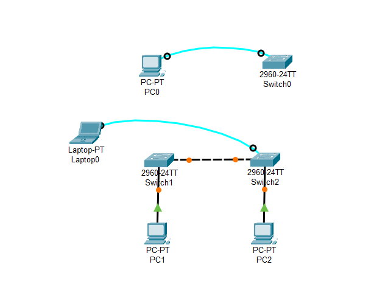

### Operating Modes in Cisco IOS

"Operating Modes in Cisco IOS" refers to the different modes or levels of operation that are available within the Cisco Internetwork Operating System (IOS). These modes determine the level of access and the types of commands that can be executed on a Cisco networking device, such as routers and switches. The main operating modes in Cisco IOS include:

#### User EXEC Mode:

- **Description:** Provides basic monitoring commands. By default `Hostname>`

#### Privileged EXEC Mode:

- **Description:** Offers full control over device configurations. In Privileged EXEC Mode `Hostname#`
- **Command:** `enable` (To access Privileged EXEC Mode)

#### Global Configuration Mode:

- **Description:** Allows changes to device settings. In Global Configuration Mode: `Hostname(config)#`
- **Command:** `configure terminal` (To access Global Configuration Mode)

#
### Setting Up the Clock on a Networking Device

Setting up the clock on a networking device is essential for:

1. **Timestamping:** Accurately recording events and logs.
2. **Synchronization:** Ensuring consistency across the network.
3. **Authentication:** Supporting security features.
4. **Logging:** Facilitating troubleshooting and security monitoring.

#### Commands

```markdown
Hostname> enable
Hostname# clock set 15:30:00 24 February 2024
Hostname# show clock
```
#
### Basic Configuration of a Switch

1. `Switch> enable` - Enter Privileged EXEC Mode
2. `Switch# show running-config` - Show the current configuration
3. `Switch# configure terminal` - Enter Global Configuration Mode
4. `Switch(config)# hostname S1` - Set the hostname to S1
5. `S1(config)# line console 0` - Enter Console Line Configuration Mode
6. `S1(config-line)# password letmein` - Set the console password
7. `S1(config-line)# login` - Enable login on the console
8. `S1(config-line)# exit`
9. `S1(config)# enable password c1$c0` - Set the privileged exec password (plaintext)
10. `S1(config)# enable secret itsasecret` - Set the privileged exec password (encrypted), overrides the enable password
11. `S1(config)# service password-encryption` - Encrypt all passwords (plaintext to encrypted)
12. `S1(config)# banner motd "Authorized Access Only!"` - Set the message of the day banner
13. `S1(config)# exit`
14. `S1# copy running-config startup-config` - Save the configuration to NVRAM (Non-Volatile RAM)

### Assigning IP Address to a Switch

To assign an IP address to a switch:

1. `S1> enable`
2. `S1# configure terminal`
3. `S1(config)# interface vlan 1` - Enter Interface Configuration Mode
4. `S1(config-if)# ip address 192.168.1.253 255.255.255.0`
5. `S1(config-if)# no shutdown` - Enable the interface

### Setting up Virtual Terminal Lines (VTY)

To set up VTY lines for remote access:

1. `S1> enable`
2. `S1# configure terminal`
3. `S1(config)# line vty 0 4` - Enter VTY Line Configuration Mode
4. `S1(config-line)# password c1$c0` - Set the VTY password
5. `S1(config-line)# login` - Enable login on the VTY lines

VTY lines are used to remotely connect to a switch using Telnet.

#
### IP Address Classes
In an IPv4 address, such as "192.168.1.100", the address is divided into four parts separated by periods. Each part is called an "octet" because it represents 8 bits of the address. The value of each octet ranges from 0 to 255. Here are the classes along with their ranges and examples:

**Class A:**
- **Range:** 1.0.0.0 to 126.255.255.255
- **Example:** 10.0.0.1, 10.0.0.2, 10.0.0.3

**Class B:**
- **Range:** 128.0.0.0 to 191.255.255.255
- **Example:** 172.16.0.1, 172.16.0.2, 172.16.0.3

**Class C:**
- **Range:** 192.0.0.0 to 223.255.255.255
- **Example:** 192.168.0.1, 192.168.0.2, 192.168.0.3

**Class D:**
- **Range:** 224.0.0.0 to 239.255.255.255
- **Example:** 224.0.0.1, 224.0.0.2, 224.0.0.3

 **Class E:**
  - **Range:** 240.0.0.0 to 255.255.255.254
  - **Example:** (Reserved for experimental purposes)

The first and last IP addresses in a subnet are typically reserved for the network address and broadcast address, respectively.

#
### Subnet and Subnet Mask

#### Subnet
A subnet is a smaller, segmented part of a larger network. It helps organize and manage network resources.

#### Subnet Mask
A subnet mask is a 32-bit number that separates the network and host portions of an IP address within a subnet. It defines the boundaries of the subnet.

###### Example
- The IP address "192.168.1.0" identifies the network.
- The subnet mask "255.255.255.0" indicates that the first 24 bits (or the first three octets) represent the network portion, while the last 8 bits (or the last octet) represent the host portion.

Within this subnet:
- The range of IP addresses that can be assigned to devices on the network is from "192.168.1.1" to "192.168.1.254".
- The first three octets (192.168.1) represent the network, and the last octet (0-254) represents individual devices within that network.

#

