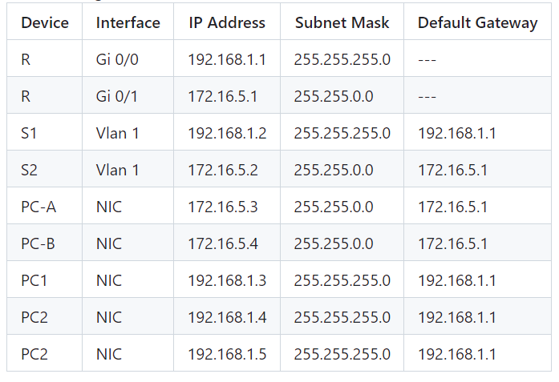
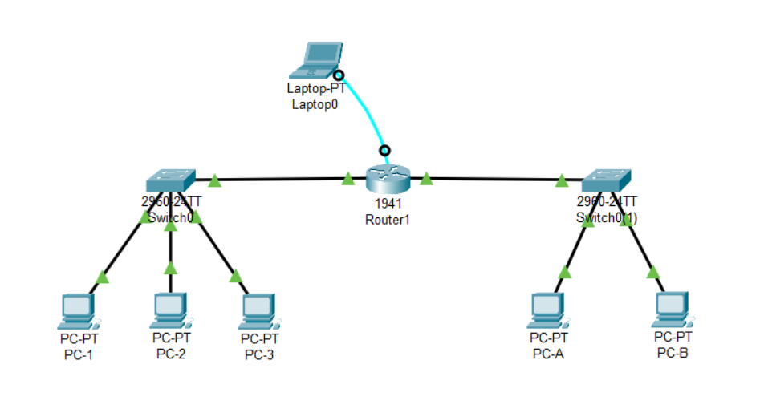

### Switch Configuration
1. `Switch> enable`- Enter Privileged EXEC Mode
2. `Switch# show running-config`- Show the current configuration
3. `Switch# configure terminal`- Enter Global Configuration Mode
4. `Switch(config)# hostname S1`- Set the hostname to S1
5. `S1(config)# line console 0`- Enter Console Line Configuration Mode
6. `S1(config-line)# password letmein`- Set the console password
7. `S1(config-line)# login`- Enable login on the console
8. `S1(config-line)# exit`- Exit Console Line Configuration Mode
9. `S1(config)# enable password c1$c0`- Set the privileged exec password (plaintext)
10. `S1(config)# enable secret itsasecret`- Set the privileged exec password (encrypted), overrides the enable password
11. `S1(config)# service password-encryption`- Encrypt all passwords (plaintext to encrypted)
12. `S1(config)# banner motd "Authorized Access Only!"`- Set the message of the day banner
13. `S1(config)# exit`- Exit Global Configuration Mode
14. `S1# copy running-config startup-config`- Save the configuration to NVRAM (Non-Volatile RAM)

 

#
### Router Configuration
1. `Router> enable`- Enter Privileged EXEC Mode
2. `Router# configure terminal`- Enter Global Configuration Mode
3. `Router(config)# interface gigabitEthernet 0/0` or `interface gigabitEthernet 0/1` - Access Interface Configuration Mode for GigabitEthernet 0/0 or GigabitEthernet 0/1- Enter Interface Configuration Mode
4. `Router(config-if)# ip address 192.168.1.1 255.255.255.0`- Set IP address and subnet mask
5. `Router(config-if)# no shutdown`- Enable the interface
6. `Router(config-if)# end`- Exit to Privileged EXEC Mode
7. `Router# copy running-config startup-config`
8. `Router# show ip interface brief`- Verify the configuration
9. `Router# exit`- Exit Interface Configuration Mode
10. `copy run start` - Save the configuration to NVRAM

 

#
### Default Gateway Configuration on Switches

1. `S1>enable` - Enter Privileged EXEC Mode
2. `S1#configure terminal` - Enter Global Configuration Mode
3. `S1(config)#ip default-gateway 192.168.1.1` - Set the default gateway
4. `S1(config)#exit` - Exit Global Configuration Mode
5. `S1#copy run start` - Save the configuration to NVRAM

 

#
### Setting up Virtual Terminal Lines (VTY)

We set up VTY (Virtual Terminal) lines to allow remote access to a device, such as a router or switch, over a network using protocols like Telnet or SSH. These lines define the number of concurrent connections allowed and specify authentication settings for users accessing the device remotely.

To set up VTY lines for remote access:

1. `S1> enable`
2. `S1# configure terminal`
3. `S1(config)# line vty 0 4` - Enter VTY Line Configuration Mode
4. `S1(config-line)# password c1$c0` - Set the VTY password
5. `S1(config-line)# login` - Enable login on the VTY lines

VTY lines are used to remotely connect to a switch using Telnet.

#
#### Telnet
Telnet is a network protocol for remote access to devices over a network. It allows users to control and manage devices from a remote location.
- `telnet 192.168.1.253` -initiates a Telnet session to the device with the IP address 192.168.1.253

 

#
#### table

#

