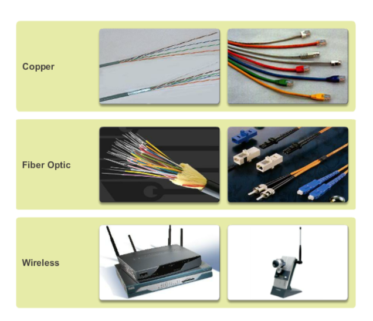
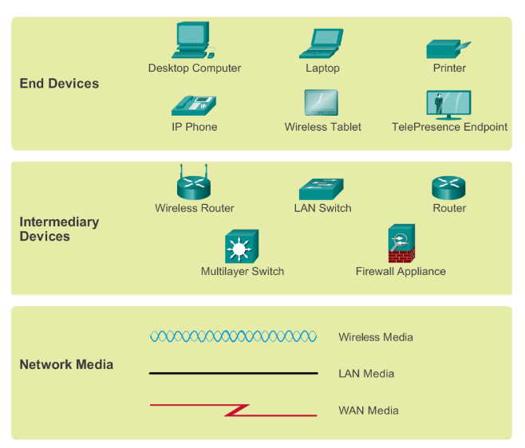
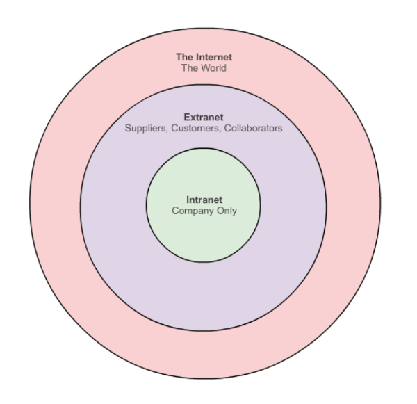

# Introduction to Computer Networks and Data Communications

## What are Computer Networks?

Computer networks are systems of interconnected devices, such as computers, servers, routers, switches, and other hardware, that communicate and share resources with each other. These networks can be as small as a local area network (LAN) within a single building or as vast as a global network like the internet.

## Key Components of Computer Networks:

1. **Nodes:** These are the devices connected to the network, such as computers, servers, printers, etc.

2. **Links:** Links are the communication pathways that connect the nodes. These can be wired (e.g., Ethernet cables) or wireless (e.g., Wi-Fi).

3. **Networking Devices:** Devices like routers, switches, and hubs facilitate communication between nodes by managing data traffic.

## Types of Computer Networks:

1. **Local Area Network (LAN):** LANs typically cover a small geographical area, such as a single building or campus. They are commonly used in homes, schools, and offices to connect devices for sharing resources like files and printers.

2. **Wide Area Network (WAN):** WANs cover larger geographical areas and often connect LANs across cities, countries, or continents. The internet is the most prominent example of a WAN.

3. **Wireless Networks:** These networks use wireless communication technologies like Wi-Fi, Bluetooth, and cellular networks to connect devices without the need for physical cables.

4. **Client-Server Networks:** In this architecture, one or more powerful computers (servers) provide services to other computers (clients) on the network.

## Data Communications:

Data communications is the process of transmitting and receiving data between two or more devices over a network. It involves encoding, transmitting, receiving, and decoding data using various communication protocols and technologies.

### Key Concepts in Data Communications:

1. **Protocols:** Communication protocols are rules and conventions that govern how data is transmitted and received between devices. Examples include TCP/IP, HTTP, and Ethernet.

2. **Packet Switching:** In packet-switched networks like the internet, data is broken down into small packets for transmission. These packets are then routed independently across the network and reassembled at the destination.

3. **Networking Models:** Models like the OSI (Open Systems Interconnection) model and the TCP/IP (Transmission Control Protocol/Internet Protocol) model provide a framework for understanding and standardizing network communication.

4. **Data Transmission Media:** Data can be transmitted over various types of media, including copper wires, fiber-optic cables, and wireless radio waves.

Understanding computer networks and data communications is essential for anyone working in the field of information technology. It forms the foundation for building and managing modern computing infrastructures, as well as developing applications and services that rely on network connectivity.

# Differences Between a Switch and a Router

## Functionality:

- **Switch:** Operates at the data link layer (Layer 2) and forwards data packets between devices within a single local area network (LAN) based on their MAC addresses.
- **Router:** Operates at the network layer (Layer 3) and forwards data packets between different networks based on their IP addresses.

## Addressing:

- **Switch:** Uses MAC addresses to forward data packets within a single network segment.
- **Router:** Uses IP addresses to forward data packets between different networks.

## Scope:

- **Switch:** Typically used within a single LAN to connect multiple devices.
- **Router:** Used to connect multiple LANs or different network segments together.

# Peer-to-Peer (P2P) Connection

## Definition:
A peer-to-peer (P2P) connection is a type of network connection where two or more devices communicate directly with each other without the need for a centralized server. In a P2P network, each device can act as both a client and a server, allowing for decentralized sharing of resources and information.

## Pros of P2P Connection:

1. **Decentralization:** P2P connections do not rely on a central server, reducing the risk of single points of failure and making the network more resilient to disruptions.
2. **Scalability:** P2P networks can easily scale as more devices are added since each device contributes resources and can communicate directly with others.
3. **Efficiency:** P2P connections can be more efficient for sharing resources like files or bandwidth since data can be distributed across multiple devices rather than relying on a single server.
4. **Privacy:** P2P connections can offer increased privacy since data is shared directly between devices without passing through centralized servers that may track or monitor communications.
5. **Cost-Effectiveness:** P2P networks can be cost-effective since they do not require the infrastructure and maintenance associated with centralized servers. Users can leverage existing resources on their devices for sharing.

## Cons of P2P Connection:

1. **Security Risks:** P2P connections may pose security risks, as devices communicate directly with each other, potentially exposing vulnerabilities and making it easier for malicious actors to exploit weaknesses in the network.
2. **Quality of Service:** Since P2P connections rely on the resources of individual devices, the quality of service may vary depending on the capabilities and reliability of each device participating in the network.
3. **Network Overhead:** P2P connections can introduce additional network overhead, especially for larger networks, as devices exchange information directly with each other rather than through centralized servers.
4. **Regulatory Concerns:** Some P2P applications and networks may face regulatory challenges, especially in the context of copyright infringement or illegal file sharing, leading to legal issues and potential shutdowns.
5. **Dependency on Participant Availability:** P2P connections rely on the availability of other participants in the network. If key participants go offline or leave the network, it may impact the availability and functionality of the network as a whole.

### Method of Commutnication

### Network Representation

# Types of Network Infrastructures

## Local Area Network (LAN)

A Local Area Network (LAN) is a network infrastructure that covers a relatively small geographic area, such as a single building, office, or campus. LANs typically use Ethernet or Wi-Fi technology to connect devices within the same physical location. They are commonly used to facilitate communication and resource sharing among computers, printers, servers, and other devices within an organization.

## Wide Area Network (WAN)

A Wide Area Network (WAN) is a network infrastructure that covers a large geographic area, such as multiple cities, countries, or continents. WANs connect LANs and other smaller networks over long distances using various communication technologies, including leased lines, fiber-optic cables, and satellite links. The internet is the most prominent example of a WAN, enabling global connectivity and communication between devices worldwide.

## Metropolitan Area Network (MAN)

A Metropolitan Area Network (MAN) is a network infrastructure that covers a larger geographic area than a LAN but smaller than a WAN, typically spanning a city or metropolitan area. MANs provide high-speed connectivity to connect multiple LANs and support communication between different locations within the same city. They are often used by telecommunications companies and large enterprises to provide services like broadband internet access and video conferencing.

## Wireless LAN (WLAN)

A Wireless LAN (WLAN) is a type of network infrastructure that uses wireless communication technology, such as Wi-Fi, to connect devices within a local area. WLANs eliminate the need for physical Ethernet cables, allowing users to connect to the network wirelessly using smartphones, laptops, tablets, and other Wi-Fi-enabled devices. WLANs are commonly deployed in homes, offices, airports, coffee shops, and other public spaces to provide flexible and convenient internet access.

## Storage Area Network (SAN)

A Storage Area Network (SAN) is a specialized network infrastructure dedicated to providing high-speed access to shared storage resources, such as disk arrays and tape libraries. SANs use Fibre Channel or iSCSI protocols to connect servers and storage devices over high-speed network connections, allowing multiple servers to access centralized storage resources simultaneously. SANs are commonly used in data centers and enterprise environments to support mission-critical applications, data backups, and disaster recovery solutions.

# Intranet and Extranet

## Intranet

An intranet is a private network infrastructure that is restricted to an organization or company and is used for internal communication, collaboration, and sharing of resources. It typically employs technologies such as web servers, databases, and email systems to provide employees with access to company information, documents, applications, and services. Intranets are often accessed using web browsers and can include features such as employee directories, company news, project management tools, and document repositories. Intranets help improve communication, streamline workflows, and facilitate knowledge sharing within an organization.

## Extranet

An extranet is an extension of an intranet that allows limited access to authorized external users, such as business partners, suppliers, customers, or clients. It provides a secure and controlled environment for sharing specific resources, information, and services with external parties over the internet. Extranets use technologies such as virtual private networks (VPNs), firewalls, and encryption to ensure data privacy and security. Common examples of extranets include customer portals for accessing account information, supplier portals for managing orders and inventory, and partner portals for collaboration on joint projects. Extranets help foster collaboration, enhance relationships, and improve efficiency in business interactions between organizations and their external stakeholders.

## Four Essential Characteristics of Network Architectures

### 1. Fault Tolerance

Ensures network resilience by minimizing disruptions in the event of component failures through redundancy and self-healing mechanisms.

### 2. Scalability

Enables networks to adapt and expand seamlessly to accommodate growth in traffic, users, and data without compromising performance.

### 3. Quality of Service (QoS)

Guarantees predictable and consistent performance for different types of traffic, prioritizing critical applications to meet service level agreements.

### 4. Security

Protects network resources, data, and communications from unauthorized access or malicious activities using authentication, encryption, and access controls.

# Security Threats to Networks

## External Threats

The most common external threats to networks include:

1. **Viruses, Worms, and Trojan Horses:** Malicious software designed to infect computers, replicate itself, and cause damage to systems or steal sensitive information.
  
2. **Spyware and Adware:** Software that secretly monitors user activity, collects information, and delivers unwanted advertisements without the user's consent.
  
3. **Zero-day Attacks (Zero-hour Attacks):** Attacks exploiting vulnerabilities in software or hardware that are unknown to the vendor or have not been patched yet.
  
4. **Hacker Attacks:** Unauthorized attempts to gain access to computer systems or networks to disrupt operations, steal data, or cause damage.
  
5. **Denial of Service (DoS) Attacks:** Attacks that flood a network, server, or application with excessive traffic or requests to overwhelm its capacity and make it inaccessible to legitimate users.
  
6. **Data Interception and Theft:** Unauthorized access or eavesdropping on network communications to intercept and steal sensitive information, such as passwords, financial data, or intellectual property.
  
7. **Identity Theft:** Unauthorized use of someone else's personal or financial information for fraudulent purposes, such as accessing accounts, making purchases, or committing other crimes.

# Security Solutions for Networks

## Network Security Components

1. **Antivirus and Antispyware:** Detect and remove malicious software.

2. **Firewall Filtering:**  Monitor and control network traffic for security.

3. **Dedicated Firewall Systems:**  Hardware/software barriers for network protection.

4. **Access Control Lists (ACL):** Rules controlling network resource access.

5. **Intrusion Prevention Systems (IPS):** Monitor and block suspicious network activity.

6. **Virtual Private Networks (VPNs):**  Secure remote network access over the internet.

