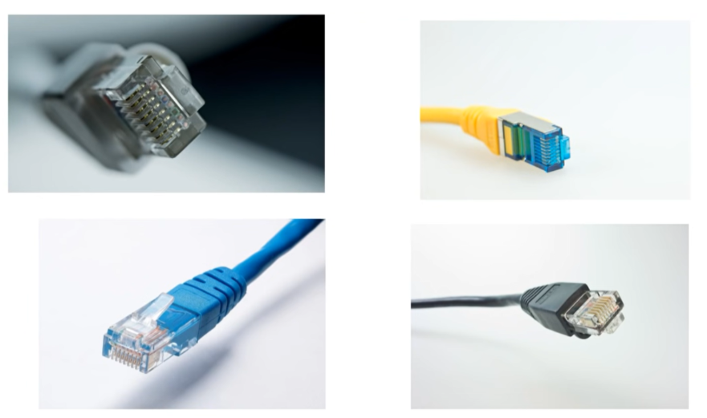
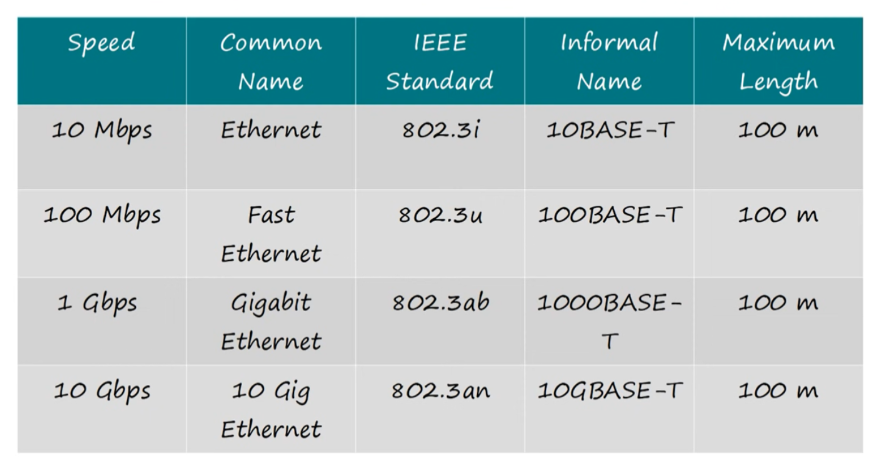
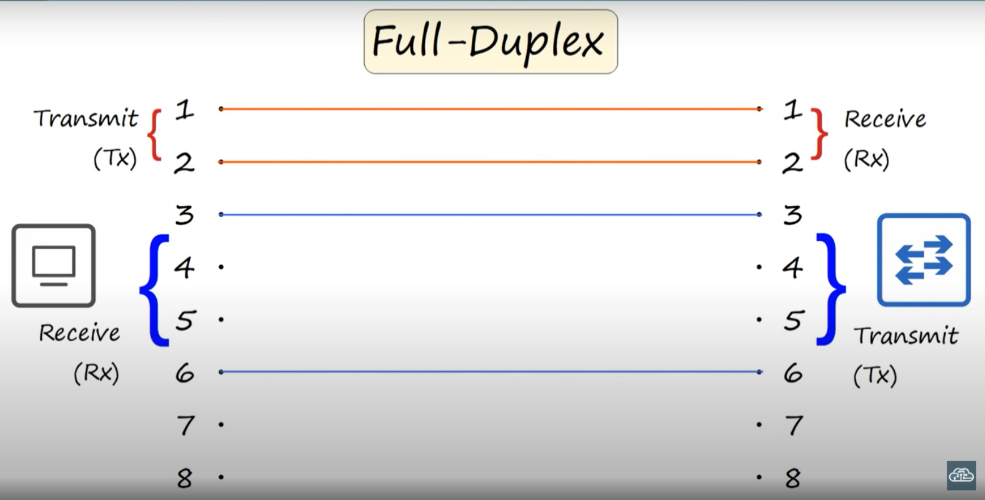
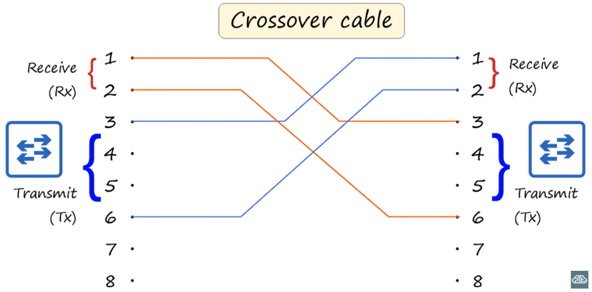
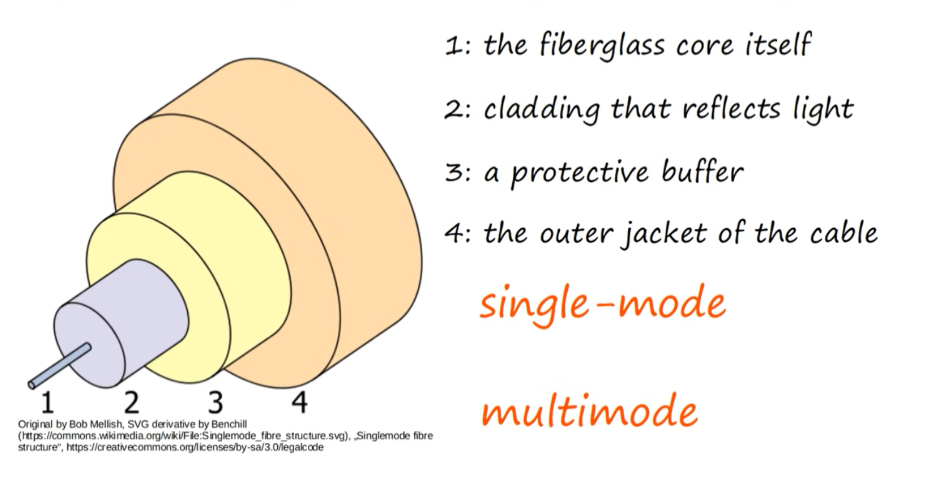
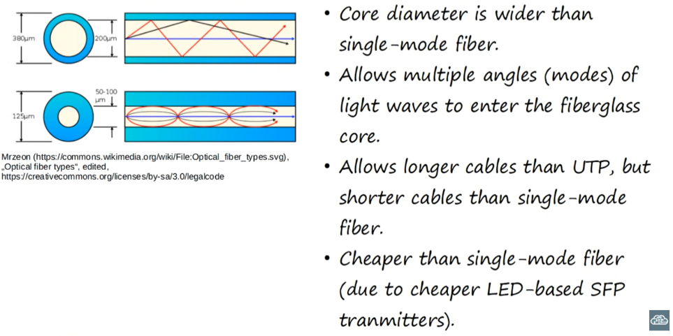
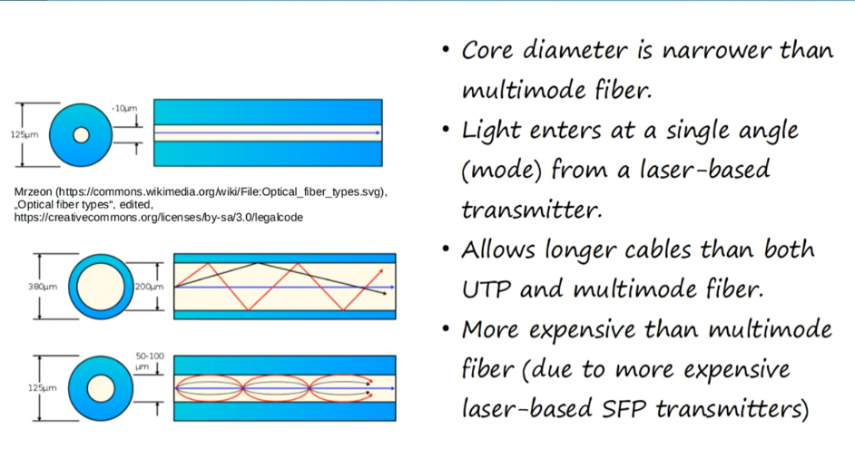
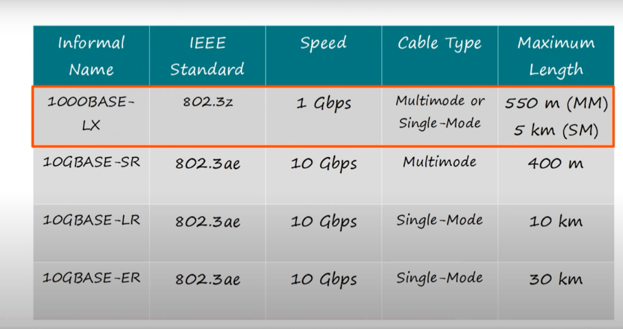
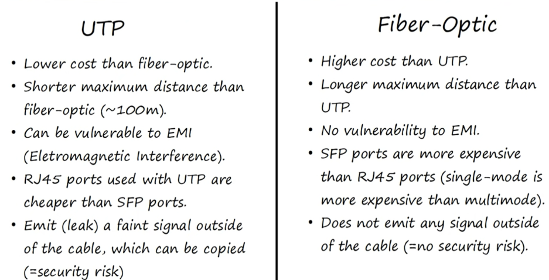

# Interfaces and Cables in Networking

## Introduction

Interfaces and cables are essential components in networking, facilitating device connections and data transmission across networks. 

- **Interfaces:** Serve as connection points enabling devices to connect to networks (e.g., Ethernet ports, Wi-Fi adapters).
- **Cables:** Physical mediums transmitting data signals between connected devices (e.g., Ethernet cables, fiber optic cables). 

# RJ-45 or Registered Jack 45 Connector 

RJ-45 is a type of plug that is commonly used for Ethernet networking. It resembles a larger version of the RJ-11 connectors used for telephone connections but has more pins. The RJ-45 connector is typically used with twisted pair cables, such as Category 5 (Cat5) or Category 6 (Cat6) cables, to connect devices to Ethernet networks. It's widely used in various network devices, including computers, routers, switches, and networked appliances. RJ-45 connectors are essential for establishing reliable and high-speed Ethernet connections in both residential and commercial networking environments.

# Ethernet

Ethernet is a widely used networking technology that allows devices to communicate with each other over a local area network (LAN). It provides a way for computers, printers, and other devices to connect and share resources, such as files and internet access. In simple words ethernet is a collection of network protocols/standards.

## How Ethernet Works

Ethernet uses a system of wired connections, typically using twisted pair cables with RJ-45 connectors, to transmit data between devices. It operates on the data link layer of the OSI model and uses a protocol called Carrier Sense Multiple Access with Collision Detection (CSMA/CD) to manage traffic on the network.

## Key Features of Ethernet

- **Speed:** Ethernet supports various speeds, ranging from traditional 10 Mbps (megabits per second) to modern gigabit (1 Gbps) and beyond.
- **Reliability:** Ethernet is known for its reliability, with robust error-checking mechanisms to ensure data integrity.
- **Scalability:** Ethernet networks can be easily expanded by adding more devices or switches to the network.
- **Compatibility:** Ethernet is compatible with a wide range of devices and operating systems, making it a versatile networking solution.

## Applications of Ethernet

Ethernet is used in various settings, including homes, offices, schools, and data centers. It enables devices to connect to the internet, access shared resources such as printers and storage devices, and communicate with each other within a network.

# IEEE (Institute of Electrical and Electronics Engineers)

IEEE is a leading professional association known for developing technical standards, fostering innovation, providing education, and promoting ethical behavior in technology. It has created widely used standards for networking, computing, and other fields, contributing to advancements in technology worldwide.

# Ethernet Standards (Copper)

# UTP Cables (Unshielded Twisted Pair)

UTP cables are a type of network cable made up of twisted pairs of copper wires. The twisting helps reduce interference from other electronic devices, ensuring clear communication between devices like computers and routers. UTP cables are widely used for Ethernet networking in homes, offices, and data centers because they're affordable, easy to install, and reliable.

# Simplex, Half Duplex, and Full Duplex

- **Simplex:** Data travels in one direction only, like a single-lane road.  
  *Example:* Television broadcasting, where the TV receives signals but doesn't send any back.

- **Half Duplex:** Data can go in both directions, but not at the same time, like a walkie-talkie.  
  *Example:* Two people using walkie-talkies; one person talks while the other listens, and then they switch.

- **Full Duplex:** Data can go in both directions simultaneously, like a two-way street with multiple lanes.  
  *Example:* A telephone conversation, where both parties can talk and listen at the same time.

  

# Straight-Through and Crossover Cables
  

## Straight-Through Cable:

- **Definition:** A straight-through cable is wired in a way that the wire at one end is connected to the corresponding pin at the other end.
  
- **Usage:** Straight-through cables are commonly used to connect devices of different types, such as a computer to a switch or router.

- **Example:** When connecting a computer to a switch, the wire connected to pin 1 at one end is also connected to pin 1 at the other end, and the same applies to the other pins.

## Crossover Cable:

- **Definition:** A crossover cable is wired in a way that the wire at one end is crossed or swapped with the wire at the other end.
  
- **Usage:** Crossover cables are typically used to connect similar devices directly, such as connecting two computers or two switches without using a hub or router.

- **Example:** In a crossover cable, the wire connected to pin 1 at one end is connected to pin 3 or 6 at the other end, and vice versa. This crossover configuration allows for direct communication between devices without the need for an intermediary device like a switch or router.

### Why Crossover Cables are Needed:

Crossover cables are needed in scenarios where direct communication between similar devices is required. When connecting two computers, two switches, or two routers directly to each other, a crossover cable is necessary to ensure that the transmitting pins on one device are connected to the receiving pins on the other device, and vice versa. Without a crossover cable, the devices wouldn't be able to communicate properly because they would both be trying to transmit on the same pins.

## Auto MDIX

Auto MDIX (Automatic Medium-Dependent Interface Crossover) is a feature in modern network devices that automatically detects and adjusts Ethernet cable connections, eliminating the need to distinguish between straight-through and crossover cables. This simplifies network setup and troubleshooting by enabling devices to communicate effectively regardless of the cable type used.

# Fibre-Optic Connections

## Multimode Fiber

## Singlemode Fiber

# Fiber-Optic Cable Standards

# UTP vs Fiber-Optic

## UTP (Unshielded Twisted Pair)

- **Description:** UTP cables consist of twisted pairs of copper wires and are commonly used for Ethernet networking.
- **Advantages:** UTP cables are affordable, easy to install, and suitable for short to medium-distance connections.
- **Limitations:** They are susceptible to electromagnetic interference (EMI) and have limited bandwidth over longer distances.

## Fiber-Optic

- **Description:** Fiber-optic cables use strands of glass or plastic fibers to transmit data using light signals.
- **Advantages:** Fiber-optic cables offer high bandwidth, immunity to EMI, and support for long-distance transmissions.
- **Limitations:** They are more expensive than UTP cables and require specialized equipment for installation and maintenance.

