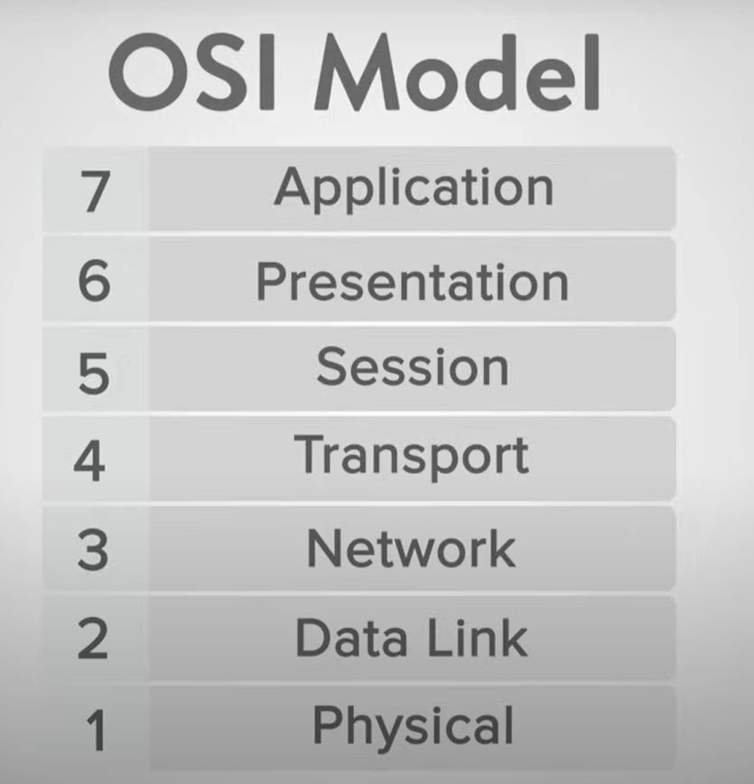
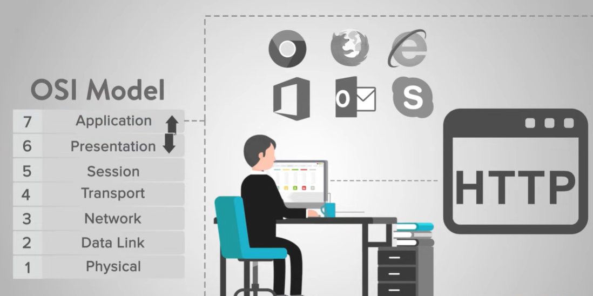
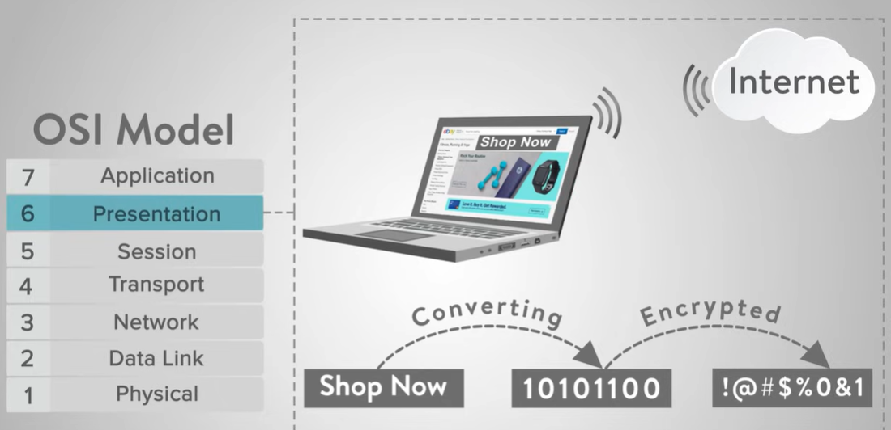
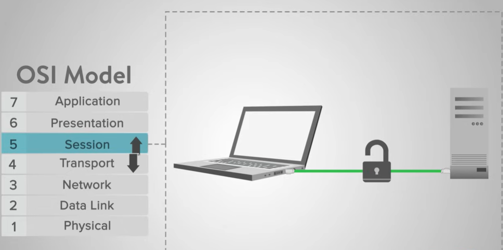
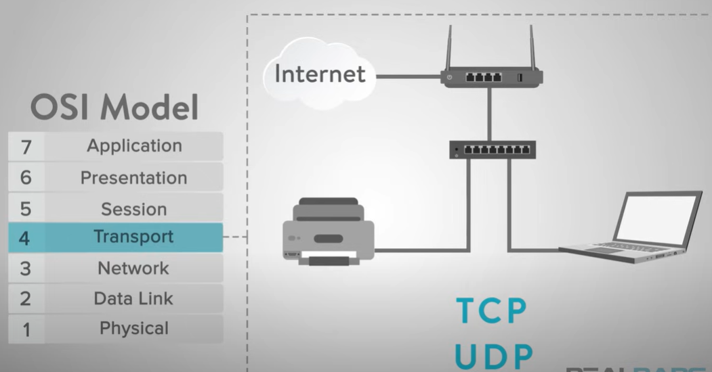
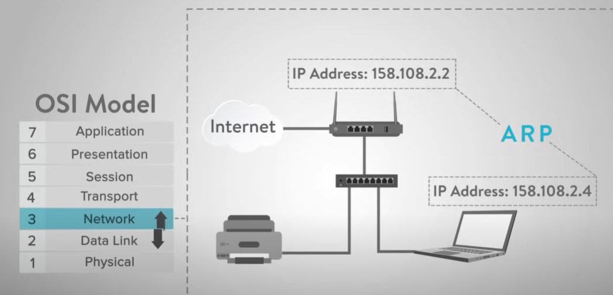
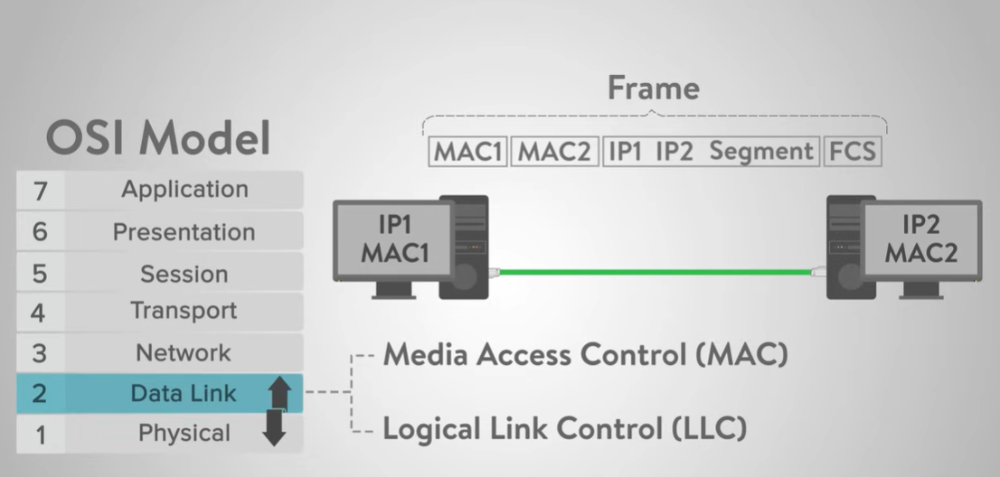
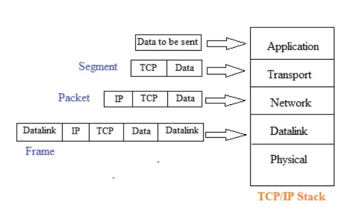
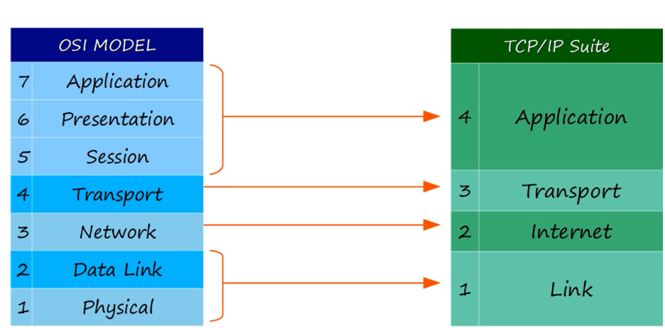
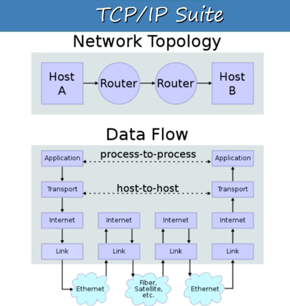

# OSI Model

The OSI (Open Systems Interconnection) Model is a conceptual framework used to understand and standardize how different networking protocols and technologies interact within a networked system. It consists of seven layers, each with specific functions and responsibilities.

## Layers of the OSI Model

1. **Physical Layer:** Deals with the physical connection between devices and transmission of raw data bits over a communication channel.

2. **Data Link Layer:** Responsible for error detection and correction, as well as controlling the flow of data between adjacent network nodes.

3. **Network Layer:** Handles routing and forwarding of data packets across multiple networks, ensuring they reach their intended destination.

4. **Transport Layer:** Manages end-to-end communication between devices, ensuring data delivery, error detection, and flow control.

5. **Session Layer:** Establishes, maintains, and terminates connections between applications on different devices, facilitating communication sessions.

6. **Presentation Layer:** Translates data between the application layer and the network, ensuring compatibility and providing services such as data encryption and compression.

7. **Application Layer:** Provides interfaces for user applications to access network services, such as email, web browsing, and file transfer.



## Application Layer
The Application Layer provides network services directly to end-users or applications. These services are implemented through protocols that handle the exchange of data between applications. For example, HTTP is a protocol used with web browsers like Google Chrome, Firefox, and Internet Explorer. Other applications that utilize the Application Layer include Office, Outlook, and Skype. These applications offer services that enable the exchange of data with the Presentation Layer, allowing for communication between different devices and platforms.



## Presentation Layer
The Presentation layer, or layer 6, performs the uncomplicated task of syntax processing or converting data from one format to another. For example, consider you are ordering something from an online store. These transactions are typically handled in a secure transmission which means that the data passing between the “store” or the Website Application will transmit encrypted data to the Presentation layer that will need to be decrypted and processed. This layer handles translating the data from the top layer, which is presented in application format, to network format and vice versa. After the Presentation layer processes the data from one format to another, the information is then passed to the Session layer or the Application layer depending on whether the data is transmitting or receiving.



## Session Layer
At the Session layer, or layer 5, the construction, direction, and conclusion of connections between devices occur. This layer supports multiple types of connections as well as being responsible for authentication and reconnection if a network interruption should occur. After the session is established the data then passes to or from the Transport layer.



## Trasnport Layer
The Transport layer, or layer 4, is responsible for the transmission of data across network connections. This layer coordinates how much data to send, how fast, where it goes, and these sorts of things. Of the most widely known protocols for internet applications, these services may be provided by Transmission Control Protocol or TCP and User Datagram Protocol or UDP. Other protocols may provide additional capabilities including error recovery, data flow, and retransmission. Once the Transport layer has completed its function, the data is then passed to or from the Network layer.



## Network Layer
The Network layer, or layer 3, handles the routing of the data. After the data arrives at this layer, each frame of data is examined to conclude if the data has reached its ultimate target. The layer sends data to the correct destination on outgoing transmissions and receives incoming transmissions as well.  The IP portion of TCP/IP is the commonly known network layer for the Internet.



## Datalink Layer
The Data Link layer, or layer 2, is considered the most complex of the layers. This layer is often divided into sublayers called Media Access Control or MAC and Logical Link Control or LLC. The layer sets up links across the physical network. When this layer receives data from the Physical layer, it checks for transmission errors and then packages the bits into data frames. From there, this layer manages the physical addressing methods for the MAC or LLC layers. An example of the MAC layer includes 802.11 wireless specifications as well as Ethernet. At the Data Link layer, the data passes to or from the final layer in the OSI model which is the Physical layer.



## Physical Layer
The Physical layer, or layer 1, is the electrical/physical layer of the model. This layer encompasses the network cables, power plugs, cable pinouts, wireless radio frequencies, connectors, transceivers, receivers, repeaters, pulses of light, electric voltages, etc. When troubleshooting problems, this is typically the first place to start. Is the device plugged in? Is the wireless card working? At this layer, the model transmits the digital data bits from the source or sending devices Physical layer, over network communications media, which can be electrical, mechanical, or radio, to the receiving or destination devices Physical layer.


## Explanation of Data Encapsulation in the OSI Model

In the OSI (Open Systems Interconnection) model, data is encapsulated at various layers as it traverses through the network. Here's how data is encapsulated at each layer:

```
Application Layer (Layer 7): Data
    ↓
Transport Layer (Layer 4): Segment
    ↓
Network Layer (Layer 3): Packet
    ↓
Data Link Layer (Layer 2): Frame
    ↓
Physical Layer (Layer 1): Transmission over Physical Medium
```

#### Definitions:

1. **Data:** At the highest layer of the OSI model, the Application Layer, data refers to the information generated or consumed by user applications. This data could be anything from text, images, audio, video, or any other type of content that users interact with.

2. **Segment:** In the Transport Layer (Layer 4) of the OSI model, data is divided into smaller units known as segments. Segmentation allows for the efficient transmission of data across a network. Each segment typically includes a header containing control information and a payload containing a portion of the original data.

3. **Packet:** At the Network Layer (Layer 3), segments are encapsulated into packets for routing through the network. A packet includes not only the segmented data but also additional information such as source and destination IP addresses, enabling routers to forward the packet towards its destination across interconnected networks.

4. **Frame:** In the Data Link Layer (Layer 2), packets are further encapsulated into frames for transmission over the physical network medium. A frame contains the packet along with additional framing information, such as MAC (Media Access Control) addresses, which are used for local network communication and determining the next hop in the network path.

This encapsulation process enables reliable communication across networks by adding headers and possibly trailer information at each layer, forming a hierarchical structure as data moves through the OSI layers.



### PDU
PDU stands for Protocol Data Unit. It is a term used to describe the data unit or packet at different layers of the OSI (Open Systems Interconnection) model or TCP/IP protocol suite. Essentially, it's the unit of data that is being transferred between network entities at each layer of the network stack. 

For example, in the OSI model:

- At the application layer, the PDU is typically referred to as a message or data.
- At the transport layer, it's commonly called a segment (for TCP) or a datagram (for UDP).
- At the network layer, it's known as a packet.
- At the data link layer, it's often referred to as a frame.
- At the physical layer, the PDU is the actual bitstream transmitted over the physical medium.

The TCP/IP model and the OSI (Open Systems Interconnection) model are both conceptual frameworks used to understand and describe the functions of networking protocols. Here's a comparison between the two:

## OSI vs TCP/IP
### TCP/IP Model:
- Developed by the Department of Defense (DoD) in the 1970s for ARPANET, the precursor to the modern internet.
- Consists of four layers: Application, Transport, Internet (or Network), and Link.
- More closely aligned with the protocols actually in use on the internet.
- Emphasizes flexibility and scalability.
- Often referred to as a "simpler" model compared to OSI.

### OSI Model:
- Developed by the International Organization for Standardization (ISO) in the 1980s.
- Consists of seven layers: Physical, Data Link, Network, Transport, Session, Presentation, and Application.
- Provides a more detailed and comprehensive framework for understanding networking protocols.
- Each layer has a specific function and abstraction level, promoting interoperability between different vendor implementations.
- Often used as a reference model for designing and understanding network architectures.

### Comparison:
- Both models are used to conceptualize networking protocols, but the OSI model is more theoretical, while the TCP/IP model is more practical.
- The OSI model has more layers, which provides a more granular view of networking functions, whereas the TCP/IP model combines some of these functions into fewer layers.
- The TCP/IP model is widely used in practice, especially on the internet, while the OSI model is primarily used as a reference model.
- Both models have their strengths and weaknesses, and understanding both can provide a comprehensive view of networking concepts and protocols.



## Network Topology



## Switch as a Layer 2 Device

Switch operates at the Data Link Layer (Layer 2) of the OSI model. It forwards data based on MAC addresses, facilitating communication within the same local network segment. Unlike routers, switches do not inspect IP addresses or perform routing between different subnets.

## IP Address Classes
In an IPv4 address, such as "192.168.1.100", the address is divided into four parts separated by periods. Each part is called an "octet" because it represents 8 bits of the address. The value of each octet ranges from 0 to 255. Here are the classes along with their ranges and examples:

**Class A:**
- **Range:** 1.0.0.0 to 126.255.255.255
- **Example:** 10.0.0.1, 10.0.0.2, 10.0.0.3

**Class B:**
- **Range:** 128.0.0.0 to 191.255.255.255
- **Example:** 172.16.0.1, 172.16.0.2, 172.16.0.3

**Class C:**
- **Range:** 192.0.0.0 to 223.255.255.255
- **Example:** 192.168.0.1, 192.168.0.2, 192.168.0.3

**Class D:**
- **Range:** 224.0.0.0 to 239.255.255.255
- **Example:** 224.0.0.1, 224.0.0.2, 224.0.0.3

 **Class E:**
  - **Range:** 240.0.0.0 to 255.255.255.254
  - **Example:** (Reserved for experimental purposes)

The first and last IP addresses in a subnet are typically reserved for the network address and broadcast address, respectively.

## Public and Private IP Address
1. **Public IP Address**: Identifies devices on the internet.
2. **Private IP Address**: Identifies devices within a local network.

## VLAN (Virtual Local Area Network)

A VLAN (Virtual Local Area Network) is a logical grouping of devices within a network, even if they are not physically located on the same network segment. VLANs are created to segment network traffic, improve network performance, and enhance security by logically dividing a single physical network into multiple isolated networks.

Devices within the same VLAN can communicate with each other as if they were connected to the same physical network, regardless of their physical location. VLANs are commonly used in enterprise networks to segregate traffic based on departments, functions, or security requirements.

### Real-Life Example of VLAN

In a university campus network, VLANs can be used to segregate network traffic based on different departments or functions. For example:

- **Faculty VLAN**: Devices used by faculty members, such as professors and administrative staff, can be assigned to a VLAN dedicated to faculty resources and communication.

- **Student VLAN**: Devices used by students, such as laptops and smartphones, can be assigned to a separate VLAN to access student-specific resources and services, such as online courses and academic databases.

- **Administrative VLAN**: Devices used by administrative offices, such as accounting and human resources, can be assigned to a VLAN that provides access to administrative applications and data.

- **Guest VLAN**: Visitors to the campus, such as guest lecturers or conference attendees, can be assigned to a VLAN that provides limited access to the internet while keeping them isolated from sensitive university resources.

These VLANs allow network administrators to control access to resources, manage bandwidth usage, and enhance security by segmenting network traffic based on the specific needs and requirements of each department or user group.

### Interface VLAN 1 Command

The `interface vlan 1` command configures a virtual LAN (VLAN) interface with the number 1. This command allows you to enter the configuration mode for VLAN 1, where you can assign IP addresses, enable or disable the interface, configure VLAN-specific settings, and manage the interface properties related to that VLAN.


## What is NAT?

NAT (Network Address Translation) is a networking technique that allows multiple devices within a local network to share a single public IP address for accessing resources on the internet. It works by translating private IP addresses used within the local network into a single public IP address when communicating with external networks. This allows devices within the local network to access the internet while hiding their individual IP addresses from external networks for security and privacy reasons.

## Example:

In a home network scenario:

- Laptop: 192.168.1.100
- Smartphone: 192.168.1.101
- Smart TV: 192.168.1.102

When any of these devices want to access a website on the internet, they send a request to the router. The router, which is connected to the internet and has a public IP address assigned by your Internet Service Provider (ISP), acts as a mediator.

Using NAT, the router translates the private IP address of each device into its own public IP address before forwarding the request to the website. For example, when the laptop (192.168.1.100) wants to access a website, the router translates its IP address to its public IP address (e.g., 203.0.113.1) before sending the request to the website.

This way, the website sees all requests coming from your router's public IP address, hiding the individual IP addresses of devices within your home network. This provides a layer of security and privacy for your devices while allowing them to access the internet using a single public IP address.

### Interface Configuration

1. `configure terminal` - Enter Global Configuration Mode
2. `interface vlan 1` - Access Interface Configuration Mode for VLAN 1
3. `ip address 192.168.1.2 255.255.255.0` - Set IP address and subnet mask
4. `no shutdown` - Enable the interface and up the link
5. `line console 0` - Enter Console Line Configuration Mode
6. `password 123` - Set the console password to "123"
7. `login` - Enable login with password on the console line
